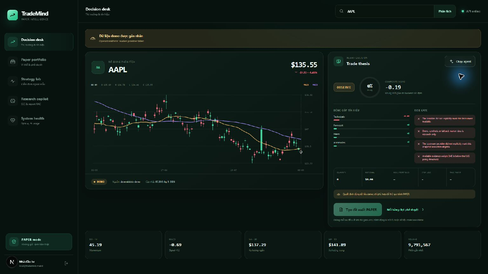
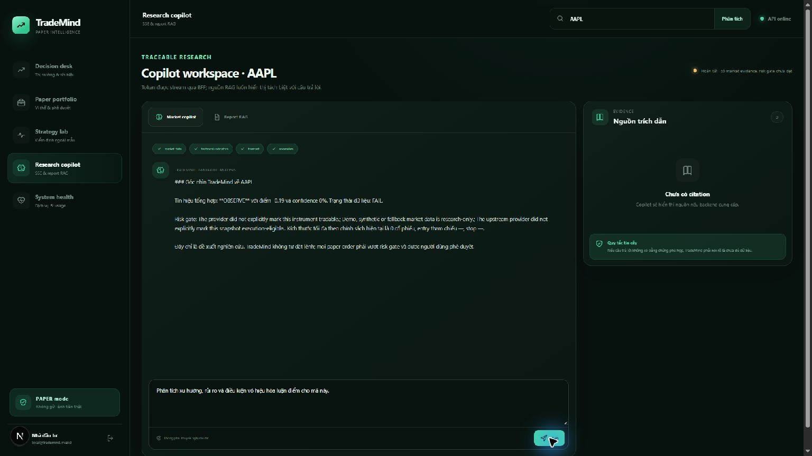
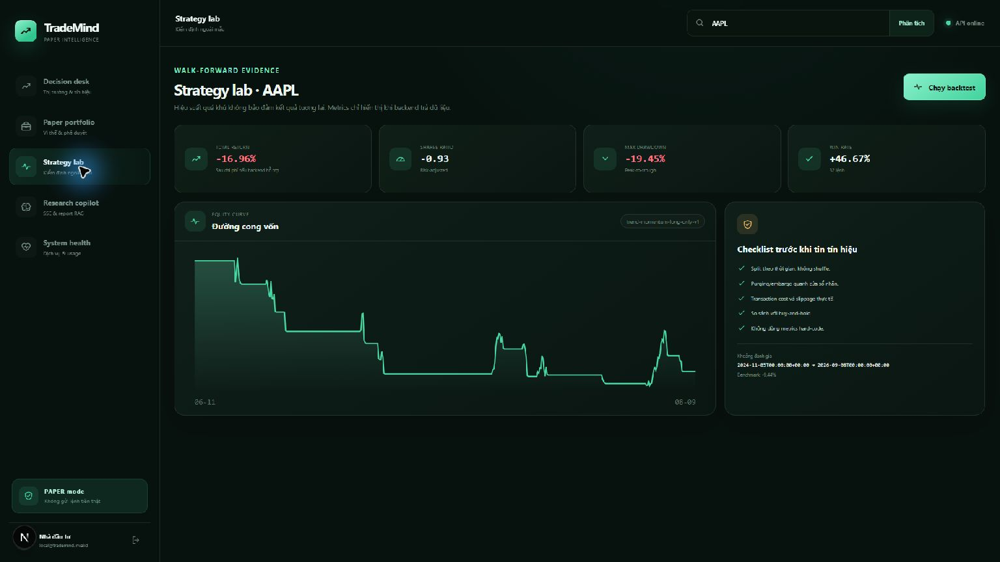
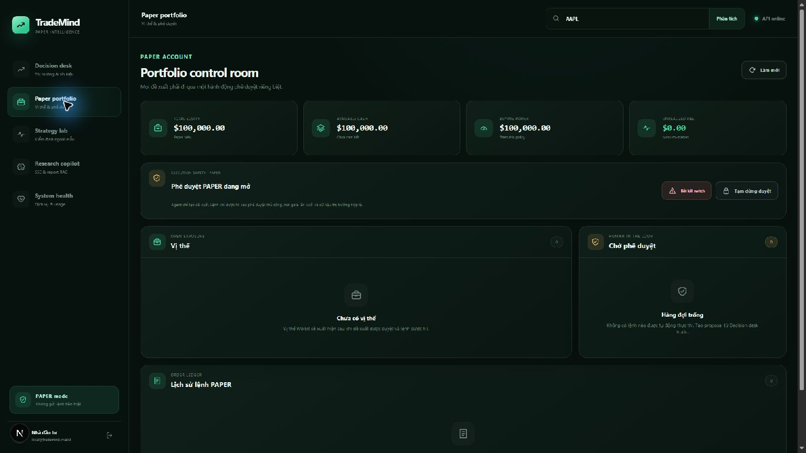
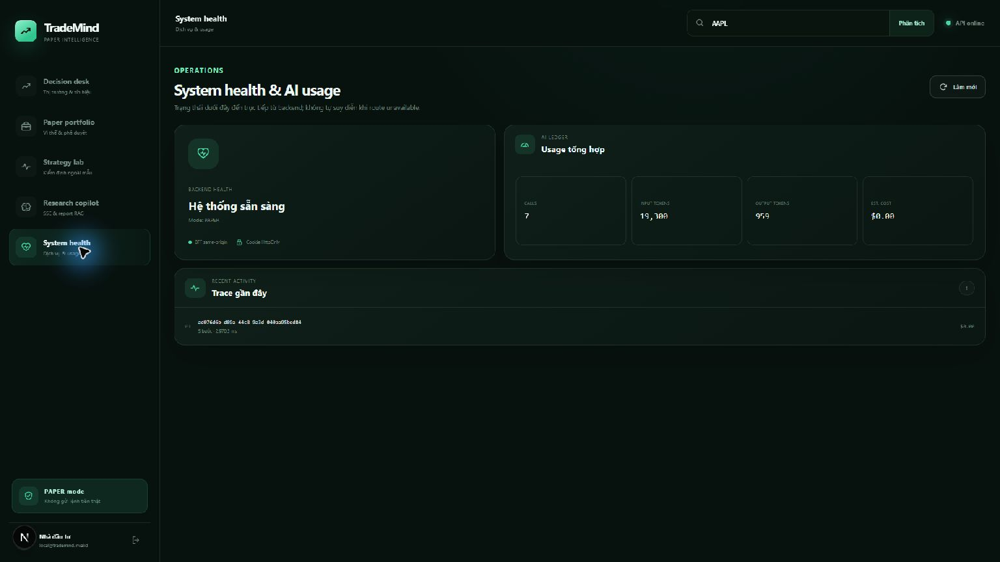

# TradeMind v3 — safety-first trading intelligence

TradeMind là một workstation nghiên cứu giao dịch có agent, Financial RAG, backtest và sổ lệnh paper. Hệ thống được thiết kế quanh một nguyên tắc: AI có thể thu thập bằng chứng và tạo **đề xuất**, nhưng không được tự đặt lệnh.

> **Ranh giới hiện tại:** TradeMind chỉ hỗ trợ tài khoản `PAPER`. Không có adapter broker, không có live trading và không nên dùng kết quả như lời khuyên đầu tư. Dữ liệu demo/fallback vẫn hữu ích để khám phá giao diện nhưng luôn bị chặn tại ranh giới phê duyệt lệnh.

## TradeMind hiện làm được gì?

| Năng lực | Trạng thái hiện tại |
|---|---|
| Market intelligence | OHLCV, MA20/MA50, RSI, MACD, ATR, volatility, news sentiment, anomaly detection và provenance |
| Trading decision | Ensemble có trọng số, contribution/rationale theo từng tín hiệu, confidence, veto và position sizing theo risk budget |
| Trading agent | Planner chỉ gọi tool trong allow-list, chạy tool song song, stream plan/tool/decision/answer qua SSE; LLM chỉ diễn giải |
| Paper workflow | Tạo proposal riêng, người dùng phê duyệt riêng, kiểm tra lại quote, idempotency, fill vào ledger SQLite |
| Portfolio controls | Bật/tắt paper trading, kill switch, lịch sử thay đổi control, cash/position/P&L theo người dùng |
| Financial RAG | Upload PDF/TXT/MD/CSV, tenant isolation, hybrid BM25 + TF-IDF + RRF, optional dense retriever, citation và no-answer policy |
| Backtest | Long-only, signal tại `t` áp dụng cho lợi nhuận `t → t+1`, phí/slippage, benchmark và các chỉ số rủi ro |
| Authentication | Scrypt password, access/refresh JWT, refresh rotation/revocation, vai trò `USER`/`ADMIN` |
| Runtime | Next.js BFF, FastAPI, SQLite, Redis với memory fallback, Docker Compose và CI |

Các model học máy tùy chọn có thể được train và nạp từ artifact. Khi không có artifact hoặc API key, TradeMind dùng baseline thống kê/lexical hoặc synthesis offline và khai báo rõ fallback; không giả vờ đó là model đã train.

## Demo sản phẩm

TradeMind đặt toàn bộ vòng đời nghiên cứu, giải thích tín hiệu và kiểm soát giao dịch paper trong một workstation. Decision Desk cho biết agent đang nghiêng về hành động nào, vì sao, bằng chứng nào đóng góp vào quyết định và risk gate có cho phép đi tiếp hay không.

<p align="center">
  
</p>
<p align="center"><sub>Decision Desk — quyết định có cấu trúc, contribution theo từng tín hiệu và ranh giới thực thi rõ ràng.</sub></p>

<table>
  <tr>
    <td width="50%">
      
      <br><sub><strong>Research Copilot</strong> — lập kế hoạch tool, tổng hợp market intelligence và hiển thị evidence/provenance.</sub>
    </td>
    <td width="50%">
      
      <br><sub><strong>Strategy Lab</strong> — backtest có benchmark, chi phí giao dịch, equity curve và checklist chống look-ahead.</sub>
    </td>
  </tr>
  <tr>
    <td width="50%">
      
      <br><sub><strong>Paper Portfolio</strong> — ledger, P&amp;L, kill switch và hàng đợi duyệt tách biệt khỏi bước ra quyết định.</sub>
    </td>
    <td width="50%">
      
      <br><sub><strong>System Health</strong> — theo dõi mode vận hành, hạn mức AI, fallback và trace của từng agent run.</sub>
    </td>
  </tr>
</table>

> Ảnh demo được chụp ở chế độ local `PAPER` với dữ liệu demo/offline. Các số liệu chỉ nhằm minh họa luồng sản phẩm, không phải tín hiệu hay khuyến nghị đầu tư.

## Luồng giao dịch có kiểm soát

```text
Market data + provenance
          │
          ▼
Data-quality gate ── fail/demo/stale ──► OBSERVE, không executable
          │ pass
          ▼
Explainable ensemble + deterministic risk sizing
          │
          ▼
Trade proposal (decision_id + Idempotency-Key, PENDING, có thời hạn)
          │
          ▼
Human approval + Idempotency-Key
          │
          ▼
Re-fetch quote + kiểm tra provenance/freshness/deviation/controls
          │
          ▼
Filled PAPER order + position/cash/audit trail
```

LLM không nằm trên đường tạo order. Agent có thể tạo một decision có cấu trúc, nhưng chỉ endpoint approval mới có thể ghi paper order và endpoint đó chạy lại toàn bộ kiểm tra an toàn.

## Chạy nhanh bằng Docker

Yêu cầu: Docker Engine/Desktop có Compose v2.

```bash
cp .env.example .env
docker compose up --build
```

Trên PowerShell, dùng `Copy-Item .env.example .env` thay cho lệnh `cp`.

- Workstation: http://localhost:3000
- API health: http://localhost:8000/api/health
- OpenAPI (development): http://localhost:8000/docs

Đăng ký tài khoản đầu tiên trên giao diện. Ở development, tài khoản người dùng đầu tiên nhận vai trò `ADMIN` và được tạo kèm `Primary Paper`. Trước khi cho người khác truy cập, hãy thay `TRADEMIND_JWT_SECRET`. Production từ chối khởi động nếu auth bị tắt, JWT secret không an toàn, thiếu `BOOTSTRAP_ADMIN_EMAIL`, hoặc `BOOTSTRAP_ADMIN_TOKEN` là placeholder/ngắn hơn 32 byte. Sau khi bootstrap admin, public registration ở production mặc định bị tắt (`ALLOW_PUBLIC_REGISTRATION=false`) và chỉ nên bật khi operator chủ động chấp nhận mô hình self-signup.

Bootstrap admin production phải khớp cả email và secret header; thực hiện trực tiếp với API khi database chưa có human user:

```bash
curl -X POST http://localhost:8000/api/auth/register \
  -H "Content-Type: application/json" \
  -H "X-Bootstrap-Token: $BOOTSTRAP_ADMIN_TOKEN" \
  -d '{"email":"admin@example.com","password":"replace-with-a-strong-password","name":"TradeMind Admin"}'
```

Ví dụ localhost chỉ phù hợp trên trusted loopback; với deployment thật, chỉ gửi header này qua HTTPS và trusted admin channel. Không ghi bootstrap token vào source, command history dùng chung hoặc frontend bundle. Sau khi admin đầu tiên tồn tại, header này không mở lại registration; `ALLOW_PUBLIC_REGISTRATION` tiếp tục quyết định self-signup production.

## Chạy local để phát triển

Yêu cầu: Python 3.11+, Node.js 20.9+ và pnpm 11.

Backend:

```bash
python -m venv .venv
# PowerShell: .\.venv\Scripts\Activate.ps1
# bash/zsh:   source .venv/bin/activate
python -m pip install -r backend/requirements-test.txt
cp .env.example .env
uvicorn backend.main:app --reload --host 127.0.0.1 --port 8000 --env-file .env
```

Frontend ở terminal khác:

```bash
cd frontend
corepack enable
pnpm install --frozen-lockfile
pnpm dev
```

Frontend gọi backend qua BFF cùng origin tại `/api/*`. Access/refresh token được BFF giữ trong cookie `HttpOnly`, tự rotate phiên khi access token hết hạn và chặn state-changing request khác origin. Nếu một refresh token đã rotate/revoke bị replay, backend revoke mọi refresh session còn active của user; access token đã phát hành vẫn hết hạn theo TTL của nó.

Redis là tùy chọn khi chạy local. Nếu `REDIS_URL` không khả dụng, cache chuyển sang in-process TTL cache và phản ánh trạng thái fallback qua health endpoint.

## Cấu hình chính

| Biến | Mặc định | Ý nghĩa |
|---|---:|---|
| `APP_ENV` | `development` | Bật validation fail-closed khi là `production`/`prod` |
| `TRADEMIND_DB_PATH` | `./data/trademind.db` trong `.env.example` | SQLite auth, portfolio, proposal, order và audit |
| `AUTH_REQUIRED` | `true` | Có thể tắt chỉ cho local demo; khi tắt vẫn dùng một identity/account local cố định |
| `ALLOW_PUBLIC_REGISTRATION` | `false` | Sau bootstrap, production từ chối self-registration trừ khi operator bật rõ ràng |
| `TRADEMIND_JWT_SECRET` | development secret | Phải là secret riêng tối thiểu 32 byte ở production |
| `BOOTSTRAP_ADMIN_EMAIL` | `admin@example.com` | Email được phép đăng ký user đầu tiên ở production |
| `BOOTSTRAP_ADMIN_TOKEN` | development placeholder | Secret gửi qua `X-Bootstrap-Token` cho admin đầu tiên; production yêu cầu giá trị riêng 32+ byte |
| `PAPER_INITIAL_CASH` | `100000` | Số dư paper ban đầu |
| `MAX_MARKET_SNAPSHOT_AGE_SECONDS` | `259200` | Tuổi quote tối đa khi approval |
| `MARKET_MAX_FUTURE_SKEW_SECONDS` | `300` | Clock skew tương lai tối đa |
| `MAX_PRICE_DEVIATION_PCT` | `5` | Sai lệch tối đa giữa giá proposal và quote lúc approval |
| `LLM_PROVIDER` | `openai-compatible` | Dùng `offline` để buộc synthesis local |
| `LLM_API_KEY` | rỗng | Khi rỗng, provider fallback minh bạch sang offline |
| `LLM_MAX_INPUT_CHARS` | `60000` | Giới hạn ký tự đầu vào mỗi lần synthesis |
| `LLM_MAX_OUTPUT_TOKENS` | `1200` | Giới hạn output token mỗi lần synthesis |
| `LLM_PRICING_JSON` | rỗng | Giá input/output theo model do operator tự cấu hình; mặc định không ước tính chi phí |
| `MAX_AI_TOKENS_PER_USER_PER_DAY` | `200000` | Ngân sách token AI theo user/ngày UTC, có reservation trước khi stream |
| `MAX_AI_CALLS_PER_USER_PER_DAY` | `100` | Số lần gọi AI tối đa theo user/ngày UTC |
| `MAX_UPLOAD_MB` | `20` | Giới hạn file trước khi parse RAG |
| `MAX_RAG_DOCUMENTS_PER_USER` | `50` | Số document RAG tối đa của mỗi user |
| `MAX_RAG_CHARACTERS_PER_USER` | `10000000` | Tổng ký tự RAG đã index tối đa của mỗi user |

Xem toàn bộ biến tại [`.env.example`](.env.example).

## API overview

Các route market cơ bản là public/read-only. Backtest vẫn chỉ phục vụ research nhưng, giống decision, dữ liệu người dùng, RAG và copilot, yêu cầu bearer identity; khi `AUTH_REQUIRED=false`, backend gắn local identity cố định. Dashboard xử lý bearer token qua BFF; client API trực tiếp gửi `Authorization: Bearer <access_token>`.

| Nhóm | Endpoint chính | Quyền |
|---|---|---|
| System | `GET /api/health`, `GET /api/config` | Public |
| Auth | `POST /api/auth/register`, `login`, `refresh`, `logout`; `GET /api/auth/me` | Tùy route; first production register cần `X-Bootstrap-Token` |
| Market | `GET /api/market/{ticker}`, `/forecast`, `/anomalies`, `/news`, `/technical-analysis` | Public/read-only |
| Screener | `POST /api/screener` | Public/read-only |
| Decision | `GET /api/trade/decision/{ticker}?account_id=...` | Authenticated |
| Backtest | `GET /api/trade/backtest/{ticker}` | Authenticated, research-only |
| Portfolio | `/api/portfolio/accounts`, `/account`, `/watchlist`, `/orders`, `/agent-runs` | Authenticated, owner-scoped |
| Controls | `POST /api/portfolio/accounts/{id}/controls`, `GET .../control-events` | Authenticated, owner-scoped |
| Proposal | `POST /api/portfolio/proposals`, `POST .../{id}/approve`, `POST .../{id}/reject` | Authenticated, owner-scoped |
| Research | `GET/POST/DELETE /api/documents`, `POST /api/rag/ask` | Authenticated, owner-scoped |
| Copilot | `POST /api/copilot/stream` | Authenticated, owner-scoped |
| Operations | `GET /api/ops/usage`, `/api/ops/traces` | `ADMIN` |

Tạo proposal bắt buộc gửi `decision_id` từ decision vừa hiển thị và một header `Idempotency-Key` dài 8–128 ký tự không có whitespace. Backend dựng lại decision với account/data/risk hiện tại; nếu ID thay đổi, client phải refresh thay vì tạo proposal từ quyết định cũ. Retry cùng proposal key và cùng decision trả proposal đã có; dùng key đó với decision khác bị từ chối.

Approval là mutation riêng và cần một `Idempotency-Key` riêng cùng body JSON `{"note": "..."}`. Retry cùng approval key cho cùng proposal trả order cũ; dùng key đó cho proposal khác bị từ chối.

ASGI middleware giới hạn body trong lúc nhận stream, trước khi FastAPI parse multipart: request thường tối đa 2 MiB, còn `/api/documents` tối đa `MAX_UPLOAD_MB` cộng 256 KiB multipart overhead. Deployment vẫn phải đặt client-body limit tương ứng tại reverse proxy để từ chối payload lớn trước khi chúng tới application process.

## Kiểm thử và evaluation

```bash
python -m compileall -q backend src evaluation
python -m pytest
python -m evaluation.run_rag_eval
cd frontend && pnpm typecheck && pnpm build
docker compose config --quiet
```

RAG regression gate dùng corpus cố định, có ba câu hỏi tài chính và một negative control. Lệnh trả exit code khác 0 nếu pass rate dưới `0.8`. Đây là smoke/regression evaluation, không phải bằng chứng rằng RAG đã đạt chất lượng production trên mọi loại báo cáo.

## Training và artifacts

Runtime không cần training stack. Muốn tạo artifact tùy chọn:

```bash
python -m pip install -r backend/requirements-train.txt
python -m src.train_model.train_forecaster --ticker AAPL --period 5y
python -m src.train_model.train_sentiment --data training/data/financial_news.csv --mode baseline
python -m src.train_model.finetune_retriever --data training/data/retriever_pairs.jsonl
```

Artifact được lưu dưới `training/outputs/`; pipeline có manifest/checksum để runtime chỉ nạp artifact phù hợp. Cần tự bảo đảm license dữ liệu, split theo thời gian, out-of-time evaluation và model card trước khi dùng cho quyết định thực tế.

## Cấu trúc repository

```text
backend/          FastAPI, auth, agent, risk/trading, RAG, persistence
frontend/         Next.js workstation và same-origin BFF
src/              Feature engineering, model runtime và training code
training/         Dữ liệu mẫu, output artifacts và model-card template
evaluation/       RAG regression dataset, fixture và evaluator
tests/            ML/data leakage/artifact tests
docs/             Architecture, safety boundary và runbook
```

Đọc tiếp:

- [Architecture](docs/ARCHITECTURE.md)
- [Safety boundary](docs/SAFETY.md)
- [Operations runbook](docs/RUNBOOK.md)
- [Capability extraction audit](docs/EXTRACTION_AUDIT.md)

## Những gì chưa có

TradeMind v3 là một local-first engineering prototype đã có test và safety boundary, **không phải hệ thống production-certified**. Account và quote hiện phải khớp chính xác currency; chưa có FX conversion. Paper fill chưa mô phỏng bid/ask spread, execution slippage, liquidity hay partial fill; backtest chỉ áp dụng mức slippage cấu hình đơn giản. Hệ thống cũng chưa có exchange calendar/session engine, corporate-action reconciliation, live broker adapter, real-time feed SLA, distributed worker, PostgreSQL/row-level security, secret manager, immutable external audit store, formal model monitoring, tax lot engine hoặc regulatory/compliance review. Không nên mở live execution chỉ bằng cách đổi một biến môi trường; đó phải là một dự án riêng có broker sandbox, authorization, reconciliation, limits, monitoring và security review độc lập.
